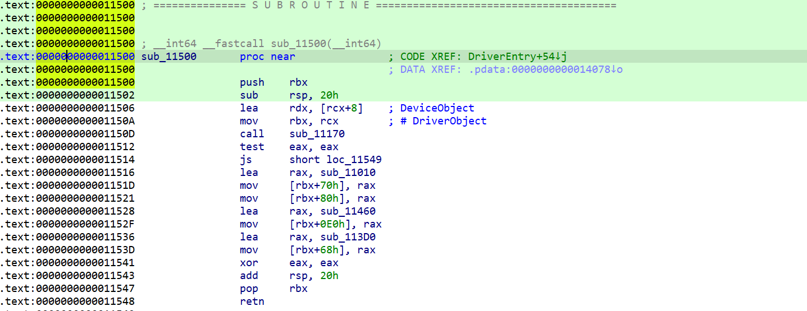

# ADV64DRV
 Reverse Engineering ADV64 Kernel Driver

 ## DESCRIPTION

File Name: ADV64DRV.sys

File Size: 13.80 KB (14128 bytes)

MD5: 778B7FEEA3C750D44745D3BF294BD4CE

SHA-1: 2261198385D62D2117F50F631652EDED0ECC71DB

[See full IDA disasembly](ida.asm)

## IMPORTS

## EXPORTS
Only DriverEntry

## DRIVER INITIALIZATION
The driver initialization function exists at offset *0x11500* which calls function *sub_11170* to initialize the device driver and create symbolic links. In the case of an error, the *IoWriteErrorLogEntry* routine queues the given error log packet to the system error logging thread.

### IRP DISPATCH ROUTINES

[sub_11010](Driver%20Codes/sub_11010.asm) -> IRP_MJ_CREATE 

[sub_11010](Driver%20Codes/sub_11010.asm) -> IRP_MJ_CLOSE

[sub_11460](Driver%20Codes/sub_11460.asm) -> IRP_MJ_DEVICE_CONTROL

[sub_113D0](Driver%20Codes/sub_113D0.asm) -> DRIVER_UNLOAD

The driver sets up a [driver unload function](Driver%20Codes/sub_113D0.asm) 

