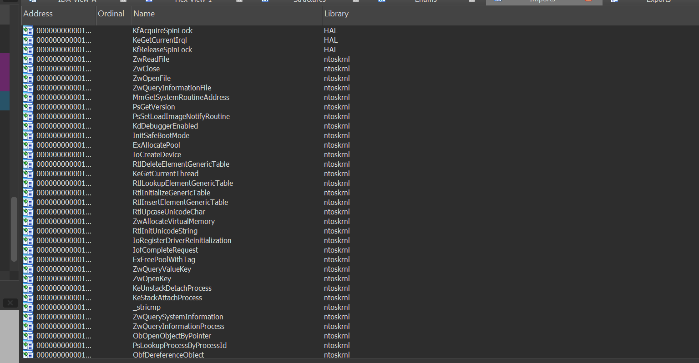
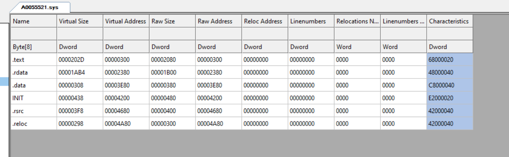

# A0055521
 Reverse Engineering Stuxnet MRXCLS Kernel Rootkit

 ## DESCRIPTION

File Name: MRXCLS.Sys

File Size: 25.99 KB (26616 bytes)

File Type: Portable Executable 32

MD5: F8153747BAE8B4AE48837EE17172151E

SHA-1: CB0793029C60C0BD059FF85DE956619F7FDEB4FD

[See full IDA disasembly](Driver%20Codes/ida.asm)

## IMPORTS

## SECTIONS

